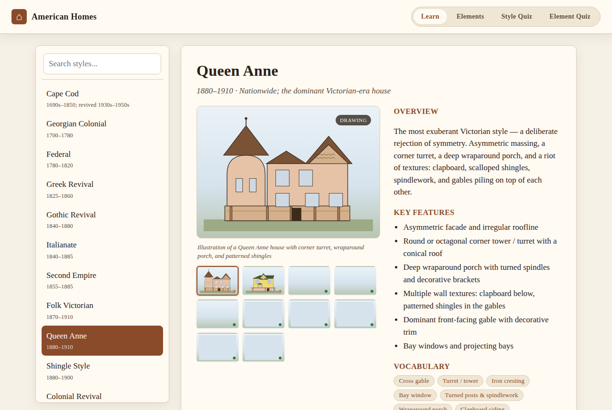
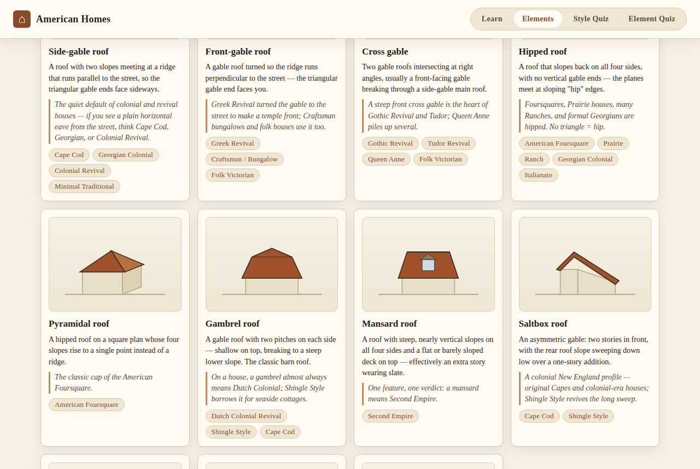

# American Homes 🏠

**Learn to name any house in America.**

### ▶︎ [Open the app](https://b8brooks.github.io/americanhomes/)

An interactive field guide to U.S. residential architecture — built to train your eye until
"nice old house" becomes "that's a Folk Victorian with an Italianate cornice."



## What's inside

- **22 styles, 1690s → today** — from Cape Cod and Georgian through Queen Anne and Craftsman to
  Ranch, Split-Level, and Neo-eclectic. Each with a teaching illustration, key features,
  regional/period context, and a **"Don't confuse with"** section covering its lookalikes.
- **An illustrated Elements glossary** — 49 components (gambrel roofs, Palladian windows,
  dentil molding, knee braces…) in 7 categories, each with a diagram, a definition, an
  identification tip, and links to the styles that wear it.
- **126 real photos** of famous houses — the Gamble House, Robie House, Lyndhurst, Carson
  Mansion, the Stahl House, and friends — resolved live from each house's Wikipedia article.
- **Two quizzes** with streaks and round grades: identify the style from a drawing or photo,
  and name the component from its diagram. Distractors are chosen from genuine lookalikes,
  so the quizzes teach the differences that matter.



## How it works

Plain HTML/CSS/JS — no build step, no framework, no tracking.

- `data.js` — the 22 styles: descriptions, features, lookalike tells, SVG illustrations
- `elements.js` — the component glossary
- `photos.js` — Wikipedia article references for the real-photo examples; the app fetches each
  article's lead image at runtime via the CORS-enabled [Wikipedia REST API](https://en.wikipedia.org/api/rest_v1/)
  and quietly hides any photo that can't be loaded
- `app.js` / `styles.css` / `index.html` — views and quizzes

## Run it locally

```bash
git clone https://github.com/B8Brooks/americanhomes.git
cd americanhomes
python3 -m http.server 8000   # then open http://localhost:8000
```

To verify all photo references still resolve (articles get renamed occasionally):

```bash
node tools/check_photos.js
```

## Deploying

Pushes to the default branch auto-deploy to GitHub Pages via
`.github/workflows/pages.yml`.
